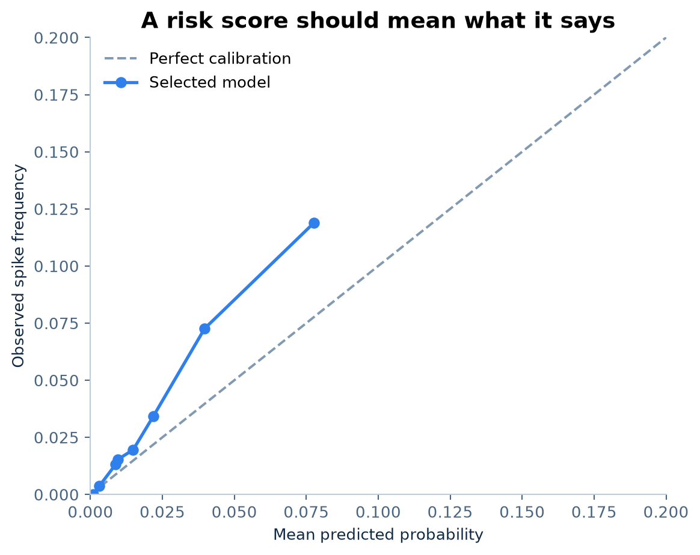

# Scarcity Before the Spike

### Forecasting ERCOT tail risk—and testing whether the forecast survives market prices

[](https://www.python.org/)
[](.github/workflows/tests.yml)
[](LICENSE)

**A market can be predictable without being mispriced.**

In ERCOT, electricity cannot wait on a shelf. A routine $30/MWh hour can become
a triple-digit scarcity event when weather-driven demand meets tight supply. This
project asks whether those hours can be identified *before* the day-ahead auction—and
then asks the harder question: did the auction already price the risk?

| Research question | Out-of-sample verdict | Key evidence |
|---|---|---|
| Can public pre-auction data rank next-day scarcity? | **Yes** | 2025 PR-AUC 0.095 vs 0.0268 base rate; 4.0× top-decile lift |
| Is the spike forecast itself a trading signal? | **No** | highest-risk decile earned a −$6.59/MWh mean RT−DA spread |
| Can a model trained directly on RT−DA find alpha? | **Candidate only** | positive 2026 lockbox P&L, but confidence and concentration tests fail |

That progression—**forecast risk, test monetization, reject what does not
survive**—is the point of the repository.


## 1 · Forecast the physical tail

The first target is deliberately operational:

> Will hourly HB_NORTH real-time price exceed **$100/MWh tomorrow**?

Only 235 of 8,759 hours crossed that threshold in 2025. An always-quiet model
would therefore be 97.3% accurate and practically worthless. Models are selected
by **precision–recall AUC**, then audited for ranking, calibration, and risk
concentration.


Gradient boosting won on 2024 validation data and was evaluated once on 2025:

- **0.095 PR-AUC**, 3.5× the random-ranking baseline;
- **0.816 ROC-AUC**;
- **10.62% realized spike rate** in the highest-risk decile, versus 2.68% overall;
- **0.0254 calibrated Brier score** after validation-only isotonic calibration.

The benchmark is intentionally broad but controlled: a seasonal prior,
regularized logistic regression, RBF SVM, random forest, histogram gradient
boosting, and a two-layer neural network all see the same chronological splits.
This is model comparison under a fixed research design, not a leaderboard search.


### What did the model learn?

The feature map combines three economic ideas: **forecast physical stress**
(48-hour GFS temperatures across five Texas cities), **market memory**
(strictly lagged prices, volatility, maxima, and spike frequency), and **seasonal
structure** (cyclical hour, weekday, and month).


Held-out permutation importance emphasizes time of day, seasonality, the same
hour one week earlier, the 48-hour price lag, volatility, and temperature
forecasts. A separate lagged-load ablation lowers validation PR-AUC from 0.084
to 0.079. More data did not mean more signal—and revision-prone annual load
archives were kept out of primary model selection.

## 2 · Ask whether the market already knew

A good scarcity forecast is not automatically alpha. The economic quantity is
the spread

$$
S_h=P_h^{RT}-P_h^{DA}.
$$

The classifier's highest-risk decile did contain four times as many spikes, but
its mean RT−DA spread was **−$6.59/MWh**. Relative to all hours, its spread lift
was **−$4.14/MWh**, with a 95% daily block-bootstrap interval of
[−$7.67, −$0.42].

In plain English: the model recognized dangerous hours, but day-ahead prices
more than compensated for that danger. Reversing the trade after seeing the
result would be post-hoc storytelling, so the original monetization hypothesis
is recorded as a failure.

## 3 · Predict mispricing directly

The second experiment gives alpha a cleaner test. Instead of converting a spike
probability into a trade, a gradient-boosting regressor forecasts hourly RT−DA
directly. A virtual-supply position sells in the day-ahead market and buys back
in real time, so it profits when RT−DA is negative. The rule was committed in
[`0a7b554`](https://github.com/JoyZhang25/ercot-scarcity-forecasting/commit/0a7b554)
before 2026 outcomes were acquired:

> Each morning at 09:00 CT, select at most one next-day hour. Enter a 1 MW
> virtual-supply position only when predicted RT−DA ≤ −$3/MWh, then deduct a
> $2/MWh research hurdle.

| Walk-forward period | Role | Trades | Mean net P&L | Daily Sharpe | 95% daily-block CI |
|---|---|---:|---:|---:|---:|
| 2024 | validation | 177 | +$12.82/MWh | 1.20 | [−$9.16, +$32.15] |
| 2025 | shadow | 274 | +$4.83/MWh | 0.82 | [−$8.48, +$13.93] |
| **2026 YTD** | **prospective lockbox** | **111** | **+$13.76/MWh** | **0.88** | **[−$21.15, +$53.00]** |


The 2026 point estimate is attractive: **$1,527 net** on 111 hypothetical 1 MW
positions, a **71.2% win rate**, and better performance than an equal-turnover
random date/hour baseline (randomization p=0.024). It is not yet credible alpha:

- the confidence interval crosses zero and the HAC t-statistic is 1.11;
- the five best days contribute 62.4% of positive P&L;
- excluding those days changes mean P&L to **−$7.01/MWh**;
- conditional on trading the same dates, hour selection beats random only at
  p=0.124.

**Verdict: positive but fragile candidate signal—not established alpha.** The
distinction is intentional. A backtest earns attention; robustness earns belief.

## Methodology

The results come first; this section shows exactly how the evidence was produced.
The two empirical paths share a point-in-time information set but answer different
questions.

| Stage | Concrete method | Auditable evidence |
|---|---|---|
| Point-in-time panel | 48-hour GFS vintages, lagged market state, cyclical calendar features | [run manifest](outputs/benchmark/run_manifest.json) |
| Scarcity model | six-family supervised-learning comparison; select by 2024 PR-AUC | [validation metrics](outputs/benchmark/validation_metrics.csv) |
| Locked forecast audit | isotonic calibration, rare-event metrics, permutation importance | [test metrics](outputs/benchmark/test_metrics.csv), [importance](outputs/benchmark/permutation_importance.csv) |
| Pricing diagnostic | risk deciles, RT−DA spread lift, operating-day block bootstrap | [risk deciles](outputs/benchmark/risk_deciles.csv) |
| Direct alpha model | regularized gradient-boosting regression and a frozen virtual-supply rule | [alpha metrics](outputs/alpha/alpha_metrics.csv) |
| Robustness gate | HAC inference, randomized baselines, tail-concentration removal | [alpha baselines](outputs/alpha/alpha_baselines.csv) |

### Step 1 · Freeze the decision time and feature set

For operating day D, the decision is made at 09:00 CT on D−1. The
available information is

$$
\mathcal F_{D-1,09{:}00}
=
\left\{
\text{48-hour GFS vintages, calendar variables, market history through }D-2
\right\}.
$$

| Feature block | Variables used | Point-in-time guardrail |
|---|---|---|
| Forecast physical stress | temperatures for five Texas cities, statewide extrema, heating/cooling degrees | fixed 48-hour forecast vintages, not realized weather |
| Market memory | RT lags at 48/72/168 hours; shifted 7-day mean, volatility, maximum; 30-day spike rate | shift first, then compute rolling statistics |
| Seasonal structure | cyclical hour, weekday, month; weekend flag | known before the auction |
| Lagged load ablation | system and weather-zone load shifted 48 hours | excluded from primary selection because annual archives can contain revisions |

The classifier excludes target-day DA price as well as target-day realized
weather, load, and RT price. Feature construction is implemented in
[build_feature_frame](src/ercot_spikes/data.py).

| Period | Role | What it may influence |
|---|---|---|
| 2021–2023 | training | fitted model parameters |
| 2024 | validation | model family and isotonic calibration |
| 2025 | locked test | one scarcity-forecast evaluation |
| 2026 YTD | prospective lockbox | one frozen-rule alpha evaluation |

### Step 2 · Compare supervised learners on validation data

The rare-event target is

$$
Y_h=\mathbf 1\!\left\{P_h^{RT}>100\ \mathrm{USD/MWh}\right\}.
$$

All candidates receive the same features and chronological split. Imputation,
scaling, and internal SVM calibration are contained inside scikit-learn pipelines
and fit from training data only.

| Candidate | ML role | 2024 validation PR-AUC |
|---|---|---:|
| Seasonal prior | smoothed non-ML benchmark | 0.056 |
| Logistic regression | regularized linear classifier | 0.053 |
| RBF SVM | nonlinear kernel classifier | 0.045 |
| Random forest | bagged tree ensemble | 0.076 |
| **Histogram gradient boosting** | **regularized boosted-tree ensemble** | **0.084 — selected** |
| Two-layer MLP | neural-network comparator | 0.067 |

Model selection ends here. The lagged-load ablation reaches 0.079 and therefore
does not improve the selected specification. The model definitions are in
[models.py](src/ercot_spikes/models.py); the selection loop is in
[experiment.py](src/ercot_spikes/experiment.py).

### Step 3 · Calibrate probabilities and open the locked test

An isotonic map fitted on 2024 converts the raw gradient-boosting score into a
probability:

$$
\widetilde p_h=f_{\mathrm{GB}}(X_h),
\qquad
\widehat p_h
=
g_{\mathrm{iso}}\!\left(\widetilde p_h\right)
\approx
\Pr\!\left(Y_h=1\mid\mathcal F_{D-1,09{:}00}\right).
$$

The frozen model and calibrator are then applied unchanged to 2025. Because only
2.68% of its hours are spikes, the audit reports PR-AUC and top-tail recall rather
than accuracy; Brier score and log loss assess probability quality.



The diagonal is perfect calibration. The curve is directionally ordered but sits
above the diagonal in the highest-risk bins, so the model still understates some
tail frequencies. The locked metrics are PR-AUC 0.095, ROC-AUC 0.816, and Brier
score 0.0254. Held-out permutation importance, shown earlier, measures the drop
in test PR-AUC after shuffling one feature at a time; it is descriptive and is
not fed back into model selection.

### Step 4 · Convert a risk forecast into a pricing diagnostic

For each delivery hour,

$$
S_h=P_h^{RT}-P_h^{DA}.
$$

The calibrated probabilities are sorted into risk deciles. The economic statistic
is

$$
Q_h\in\{1,\ldots,10\},
\qquad
\Delta_{\mathrm{spread}}
=
\mathbb E[S_h\mid Q_h=10]-\mathbb E[S_h].
$$

Whole operating days—not individual hours—are resampled for the confidence
interval, preserving within-day dependence. The earlier risk-lift figure is the
visual output of this step: the top decile concentrates spikes, but the estimate
is

$$
\widehat\Delta_{\mathrm{spread}}
=-\$4.14/\mathrm{MWh},
\qquad
\mathrm{CI}_{95\%}=[-\$7.67,-\$0.42].
$$

The implementation is in
[evaluation.py](src/ercot_spikes/evaluation.py).

### Step 5 · Estimate mispricing directly and freeze the trade

The second path changes the target instead of reversing the failed scarcity
trade. A histogram-gradient-boosting regressor estimates

$$
m_h
=
\mathbb E\!\left[S_h\mid\mathcal F_{D-1,09{:}00}\right],
$$

using a clipped training target, learning rate 0.04, at most 15 leaf nodes,
L2 regularization 20, and 120 boosting iterations. It adds lagged DA and
spread history plus the prior operating day's already-cleared DA curve; the
target day's DA clearing price remains unavailable.

For each operating day, the frozen rule is

$$
h_D^\star=\arg\min_{h\in D}\widehat m_h,
\qquad
I_D=\mathbf 1\!\left\{\widehat m_{h_D^\star}\le -3\right\},
$$

and the net P&L of the 1 MW virtual-supply position is

$$
\Pi_D
=
I_D\left(P_{h_D^\star}^{DA}-P_{h_D^\star}^{RT}
-2\ \mathrm{USD/MWh}\right).
$$

The model refits at year boundaries: through 2023 for 2024 validation, through
2024 for the 2025 shadow period, and through 2025 for the 2026 lockbox. The rule
is implemented in [alpha.py](src/ercot_spikes/alpha.py) and was committed before
the 2026 outcomes were acquired.

### Step 6 · Require statistical and economic robustness

The prospective point estimate is subjected to several different failure tests:

| Diagnostic | 2026 result | Interpretation |
|---|---:|---|
| Mean net P&L | +$13.76/MWh | economically positive point estimate |
| 95% operating-day block-bootstrap CI | [−$21.15, +$53.00] | **fails to exclude zero** |
| Newey–West HAC t-statistic | 1.11 | weak time-series evidence |
| Same-date random-hour p-value | 0.124 | hour selection is not significant |
| Equal-turnover random date/hour p-value | 0.024 | beats the broader random baseline |
| Top-five profit-day share | 62.4% | highly concentrated |
| Mean after removing five best trades | −$7.01/MWh | sign reverses |

The diagnostics disagree, which is precisely why the project stops at
**candidate signal**. A positive backtest is necessary; stable, uncertainty-aware
evidence is required before using the word alpha.

The complete assumptions are recorded in the
[research methodology](docs/methodology.md), [locked-test results](docs/results.md),
[model card](docs/model-card.md), and preregistered
[alpha protocol](docs/alpha_protocol.md).

The [research notebook](notebooks/ercot_price_spike_forecasting.ipynb) is the guided
walkthrough; reusable code lives in `src/ercot_spikes/` and is covered by tests.

## Reproduce

```bash
python -m venv .venv
.venv/bin/pip install -e '.[dev]'

# Download public ERCOT and weather inputs; raw files remain outside Git.
.venv/bin/python scripts/download_data.py

.venv/bin/ercot-spike-benchmark \
  --config configs/experiment.toml \
  --output outputs/benchmark

.venv/bin/ercot-alpha-research \
  --config configs/alpha_lockbox.toml \
  --output outputs/alpha

.venv/bin/pytest
```

See the [data contract](data/README.md) for source IDs, schemas, timing
assumptions, and the distinction between archived forecasts and realized system
variables.

<details>
<summary><strong>Repository map</strong></summary>

```text
configs/experiment.toml             frozen target, clock, split, and seed
configs/alpha_lockbox.toml           preregistered trading rule and alpha gate
notebooks/                           recruiter-readable research narrative
src/ercot_spikes/                    features, models, evaluation, and figures
tests/                               time-alignment and model-contract tests
outputs/benchmark/                   locked metrics, predictions, and figures
outputs/alpha/                       alpha metrics, baselines, and manifest
docs/                                methods, results, protocol, and limitations
```

</details>

## Scope

This is a reproducible research project, not investment advice or an ERCOT
operational tool. The virtual-supply study assumes a price-taking 1 MW position
that clears; it does not model QSE fees, collateral, uplift, bid-curve
non-clearance, or market impact. Results are not a promise of future performance.
