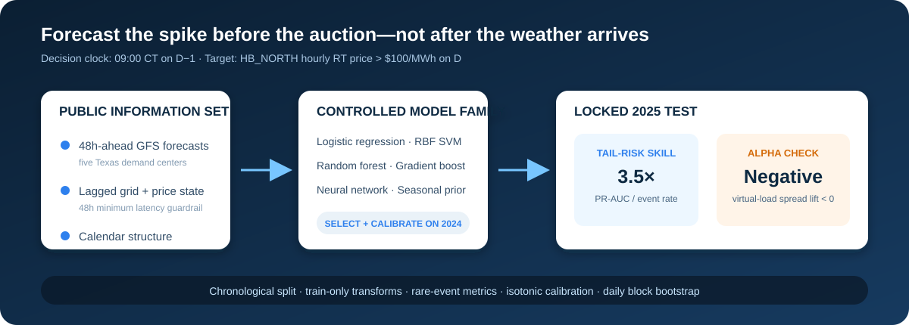
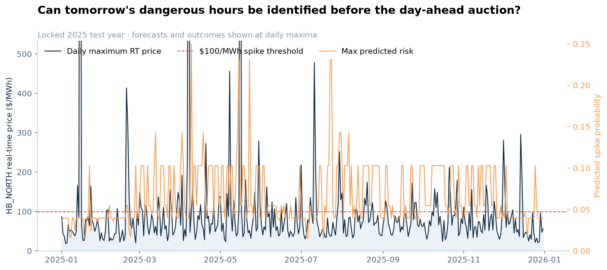
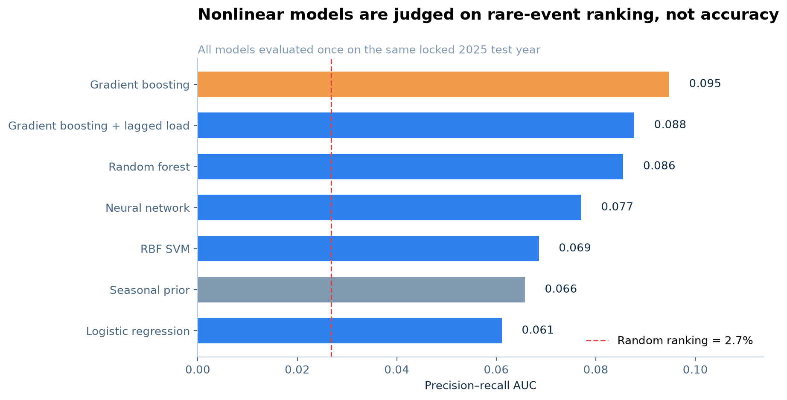
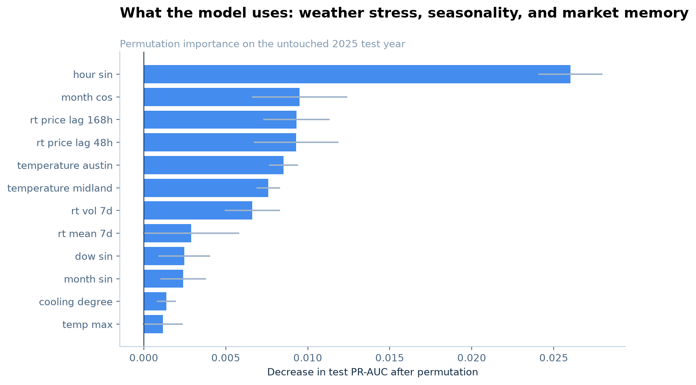
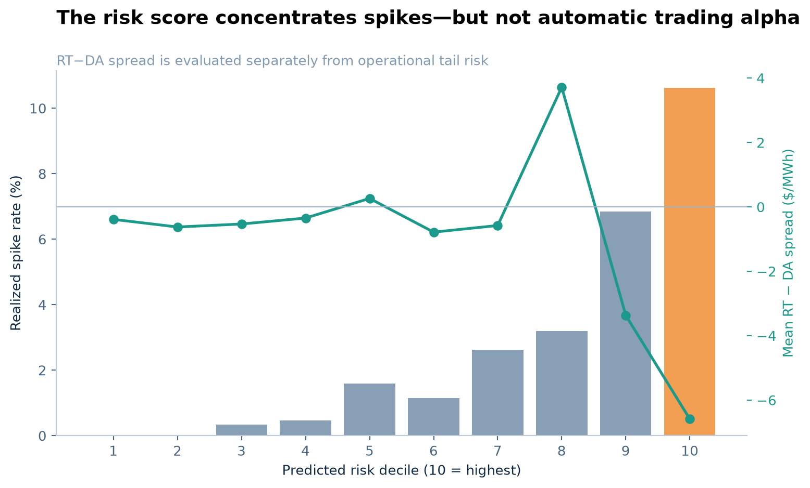
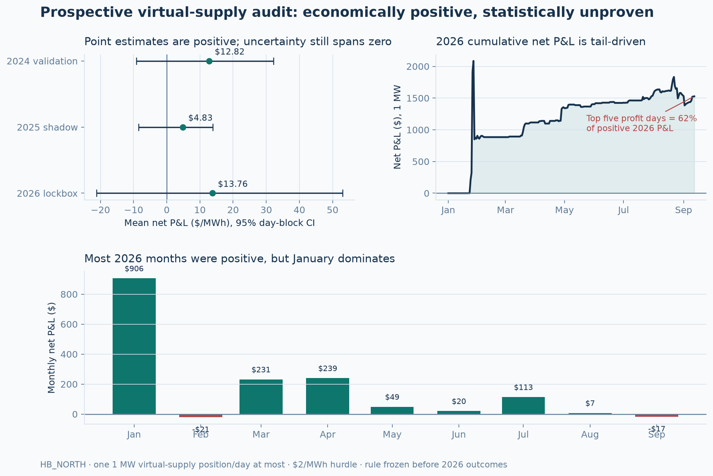

# Scarcity Before the Spike

### Point-in-time machine learning for next-day ERCOT price extremes

[](https://www.python.org/)
[](.github/workflows/tests.yml)
[](LICENSE)

Electricity is perishable. When Texas demand and supply approach the edge, a
routine $30/MWh hour can become a triple-digit event before a trader can wait for
tomorrow's realized weather. This project asks a decision-relevant question:

> **Using only information available by 09:00 CT on the previous day, can we
> identify which next-day ERCOT hours will exceed $100/MWh in real time?**

The answer is useful but deliberately qualified. The model finds operational tail
risk. A separate, prospectively frozen virtual-supply study produces positive
2026 P&L, but fails its own statistical and concentration gates. This repository
therefore distinguishes **forecast skill**, an **alpha candidate**, and an
**established alpha** rather than treating them as synonyms.



## The result in one minute

The model family was selected on 2024, then evaluated once on a locked 2025 test
year: 8,759 hours, of which 235 (2.68%) were spikes.

| Locked 2025 result | Value | Interpretation |
|---|---:|---|
| Selected model | Gradient boosting | chosen on 2024 PR-AUC, not post-hoc on test |
| PR-AUC | **0.095** | 3.5× the 0.0268 random-ranking baseline |
| ROC-AUC | **0.816** | strong ranking across thresholds |
| Highest-risk decile spike rate | **10.62%** | 4.0× the unconditional event rate |
| Calibrated Brier score | **0.0254** | probability error after validation-only isotonic calibration |
| Top-decile RT−DA spread lift | **−$4.14/MWh** | 95% daily block-bootstrap CI [−$7.67, −$0.42] |

That last row matters. Hours can be predictably dangerous without being
predictably mispriced: the day-ahead auction may already price the same weather and
scarcity risk. The project keeps **forecasting skill** and **economic value** as two
separate hypotheses.



## Why this is a machine-learning problem

Spikes are rare, nonlinear, seasonal, and regime-dependent. Accuracy is the wrong
score—predicting “no spike” every hour would be more than 97% accurate in 2025.
The experiment therefore compares a controlled set of supervised learners using
precision–recall AUC, calibration, and top-risk recall.



| Model family | 2024 validation PR-AUC | 2025 test PR-AUC |
|---|---:|---:|
| Seasonal hour/month prior | 0.056 | 0.066 |
| Regularized logistic regression | 0.053 | 0.061 |
| RBF support vector machine | 0.045 | 0.069 |
| Random forest | 0.076 | 0.086 |
| **Histogram gradient boosting** | **0.084** | **0.095** |
| Gradient boosting + lagged load | 0.079 | 0.088 |
| Two-layer neural network | 0.067 | 0.077 |

Gradient boosting wins the 2024 selection period and remains best in 2025. The
choice is nevertheless governed by validation—not by looking at test rankings.

## What the model knew—and what it did not

At the decision time, the feature set contains:

- **forecast weather stress:** fixed 48-hour-lead GFS temperature vintages for
  Dallas, Houston, Austin, San Antonio, and Midland; regional extrema and
  heating/cooling degrees;
- **lagged market state:** HB_NORTH prices at 48, 72, and 168 hours; shifted
  seven-day level, volatility, maximum, and trailing spike frequency;
- **calendar structure:** cyclical hour, weekday, and month encodings.

The classifier does **not** receive realized target-day weather, contemporaneous
load, target-hour real-time price, or day-ahead settlement price. DA price appears
only in the economic diagnostic.

An additional **retrospective lagged-load ablation** uses ERCOT annual native-load
archives shifted by 48 hours. Because those annual files can include settlement
revisions unavailable at the original decision time, the block is not eligible for
primary-model selection. It also lowers 2024 validation PR-AUC from 0.084 to 0.079.
This is feature ablation doing its job—more data is not automatically more signal.



Held-out permutation importance says the model primarily uses time-of-day,
seasonality, the same hour one week earlier, the 48-hour price lag, price
volatility, and Austin/Midland temperature forecasts. This is more informative than a generic “tree model
worked” claim: the learned ranking is an interaction between physical stress,
market memory, and seasonal structure.

## Does the signal become alpha?

Not by simply trading the spike score. The highest-risk decile contains far more
price spikes, but its mean 2025 RT−DA spread is −$6.59/MWh. Relative to all hours,
the top-decile spread lift is −$4.14/MWh and its daily block-bootstrap interval
lies below zero.



That failure motivates a second research design which predicts the economic target
directly. The rule was committed before the 2026 outcomes were downloaded:

> At 09:00 CT on D−1, forecast hourly `RT−DA`; if the day's most-negative forecast
> is at most −$3/MWh, place one 1 MW virtual-supply position in that hour. Otherwise
> do not trade. Deduct a $2/MWh research hurdle from every cleared position.

| Walk-forward period | Role | Trades | Mean net P&L | Daily Sharpe | 95% daily-block CI |
|---|---|---:|---:|---:|---:|
| 2024 | validation | 177 | +$12.82/MWh | 1.20 | [−$9.16, +$32.15] |
| 2025 | shadow | 274 | +$4.83/MWh | 0.82 | [−$8.48, +$13.93] |
| **2026 YTD** | **prospective lockbox** | **111** | **+$13.76/MWh** | **0.88** | **[−$21.15, +$53.00]** |



The 2026 point estimate is economically positive: $1,527 net on 111 hypothetical
1 MW positions, with a 71.2% win rate. The model also beats an equal-turnover
random date/hour baseline in the frozen sample (randomization p=0.024). But the
more important robustness tests fail:

- the block-bootstrap interval still includes zero and the HAC t-statistic is 1.11;
- the five best days contribute 62.4% of positive P&L;
- removing those five days changes the remaining mean to **−$7.01/MWh**;
- conditional on the same trade dates, choosing the hour beats random only at
  p=0.124.

The correct verdict is therefore **positive but fragile candidate signal, not
established alpha**. This is closer to buy-side research practice than reporting only a
backtest Sharpe: the economic target is direct, the clock is point-in-time, the
rule is frozen before the lockbox, costs are explicit, and failed inference is
shown rather than hidden. The full preregistration and rejection rule are in the
[alpha protocol](docs/alpha_protocol.md).

## Research design

```text
prediction clock        09:00 CT on operating day D−1
target                  1{hourly HB_NORTH RT price on D > $100/MWh}
training                2021–2023
selection/calibration   2024
locked test             2025
primary metric          precision–recall AUC
uncertainty             daily block bootstrap for the RT−DA diagnostic
```

The implementation demonstrates **rare-event classification, class weighting,
regularized linear models, kernel SVMs, bagging, gradient boosting, neural
networks, chronological validation, probability calibration, ablation-quality
baselines, permutation importance, direct spread regression, sparse position
selection, randomized trading baselines, HAC inference, and block-bootstrap
inference**—all within one coherent market question.

Read the full [methodology](docs/methodology.md), [locked-test interpretation](docs/results.md),
and [model card](docs/model-card.md). The
[research notebook](notebooks/ercot_price_spike_forecasting.ipynb) provides a
guided, executable walkthrough; reusable logic lives in `src/ercot_spikes/` and is
covered by tests.

## Reproduce

```bash
python -m venv .venv
.venv/bin/pip install -e '.[dev]'

# Public raw inputs are downloaded locally and remain outside Git.
.venv/bin/python scripts/download_data.py

.venv/bin/ercot-spike-benchmark \
  --config configs/experiment.toml \
  --output outputs/benchmark

.venv/bin/ercot-alpha-research \
  --config configs/alpha_lockbox.toml \
  --output outputs/alpha

.venv/bin/pytest
```

See the [data contract](data/README.md) for source IDs, schemas, timing assumptions,
and the distinction between archived forecasts and realized system variables.

## Repository map

```text
configs/experiment.toml             frozen target, clock, split, and seed
configs/alpha_lockbox.toml           preregistered trading rule and alpha gate
notebooks/                           recruiter-readable research narrative
src/ercot_spikes/                    data, features, models, evaluation, figures
tests/                               time alignment and model-contract tests
outputs/benchmark/                   locked metrics, predictions, and figures
outputs/alpha/                       alpha metrics, baselines, and manifest
docs/                                methodology, results, and model limitations
```

## Scope

This is a reproducible research project, not investment advice or an ERCOT
operational tool. The virtual-supply diagnostic assumes a price-taking 1 MW offer
that clears and does not model QSE fees, collateral, uplift, bid-curve
non-clearance, or market impact. Results are not a promise of future performance.
