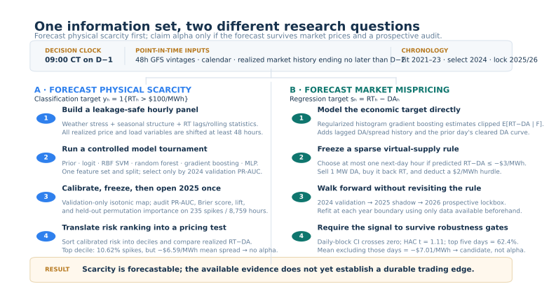

# Scarcity Before the Spike

### Forecasting ERCOT tail risk—and testing whether the forecast survives market prices

[](https://www.python.org/)
[](.github/workflows/tests.yml)
[](LICENSE)

**A market can be predictable without being mispriced.**

In ERCOT, electricity cannot wait on a shelf. A routine $30/MWh hour can become
a triple-digit scarcity event when weather-driven demand meets tight supply. This
project asks whether those hours can be identified *before* the day-ahead auction—and
then asks the harder question: did the auction already price the risk?

| Research question | Out-of-sample verdict | Key evidence |
|---|---|---|
| Can public pre-auction data rank next-day scarcity? | **Yes** | 2025 PR-AUC 0.095 vs 0.0268 base rate; 4.0× top-decile lift |
| Is the spike forecast itself a trading signal? | **No** | highest-risk decile earned a −$6.59/MWh mean RT−DA spread |
| Can a model trained directly on RT−DA find alpha? | **Candidate only** | positive 2026 lockbox P&L, but confidence and concentration tests fail |

That progression—**forecast risk, test monetization, reject what does not
survive**—is the point of the repository.


## How the evidence is built

Every prediction is made at **09:00 CT on operating day D−1**. The model may use
fixed 48-hour weather forecasts, calendar structure, and market history available
by then. It may not use target-day realized weather, load, or real-time price.
The scarcity classifier also excludes the target-day day-ahead settlement price.

| Period | Role | What it can influence |
|---|---|---|
| 2021–2023 | training | fitted parameters |
| 2024 | validation | model choice and probability calibration |
| 2025 | locked test | one evaluation of the scarcity hypothesis |
| 2026 YTD | prospective lockbox | one evaluation of the frozen alpha rule |

This clock matters more than model complexity. A powerful learner with revised
weather, contemporaneous load, or future prices would be an excellent backtest
and a useless forecast.



### Step 1 · Construct the point-in-time hourly panel

For each HB_NORTH delivery hour h, the pipeline creates three feature blocks:

- **forecast physical stress:** fixed 48-hour GFS forecast vintages for Austin,
  Dallas, Houston, Midland, and San Antonio, plus statewide temperature extrema
  and heating/cooling degrees;
- **market memory:** HB_NORTH real-time price lags at 48, 72, and 168 hours,
  together with shifted seven-day mean, volatility, maximum, and trailing spike
  frequency;
- **seasonal structure:** cyclical hour, weekday, and month encodings and a
  weekend indicator.

The 48-hour shift happens *before* rolling statistics are computed. Target-day
realized load, weather, RT price, and DA price therefore cannot leak into the
features. Lagged native load is retained only as an ablation because its annual
archives can contain later settlement revisions. The construction is implemented
in [build_feature_frame](src/ercot_spikes/data.py); the resulting feature names
and timing guardrail are recorded in the
[run manifest](outputs/benchmark/run_manifest.json).

### Step 2 · Select a model without touching the locked year

Six model families see the same features and chronological split: a smoothed
seasonal prior, class-weighted logistic regression, calibrated RBF SVM, random
forest, class-weighted histogram gradient boosting, and a two-layer MLP. Missing
value imputation, scaling, and internal SVM calibration live inside scikit-learn
pipelines, so they are fit from training data only.

The models fit on 2021–2023 and compete on **2024 PR-AUC**. That metric—not 2025
performance—selects gradient boosting. The selected model's 2024 scores then fit
an isotonic calibration map; model and calibrator are then applied unchanged to
2025. The complete selection record is in
[validation_metrics.csv](outputs/benchmark/validation_metrics.csv), and the
implementation is in [models.py](src/ercot_spikes/models.py) and
[experiment.py](src/ercot_spikes/experiment.py).

### Step 3 · Audit ranking, probabilities, and learned signal

With spikes comprising only 2.68% of 2025 hours, accuracy would reward an
always-no-spike rule. The locked audit therefore separates three questions:

1. **Ranking:** PR-AUC, ROC-AUC, and recall/precision among the top 5% of scores.
2. **Probability quality:** Brier score, log loss, and a reliability diagram
   after validation-only isotonic calibration.
3. **Interpretation:** held-out permutation importance measures the decrease in
   test PR-AUC when one feature is shuffled; the lagged-load ablation asks whether
   a plausible extra data block improves validation performance.

At this stage the output is a calibrated estimate of the probability that RT(h)
exceeds $100/MWh, conditional on information available at 09:00 CT on D−1. It
is a scarcity forecast—not yet a position. The underlying evidence is preserved in
[test_metrics.csv](outputs/benchmark/test_metrics.csv),
[test_predictions.csv](outputs/benchmark/test_predictions.csv), and
[permutation_importance.csv](outputs/benchmark/permutation_importance.csv).

### Step 4 · Test whether forecast risk was already priced

The locked 2025 probabilities are ranked into deciles. Within each decile the
pipeline measures both the realized spike frequency and the economic spread,
defined as RT(h) − DA(h).

The pricing statistic is the top-risk-decile mean spread minus the unconditional
mean spread. Its uncertainty is recomputed by resampling whole operating days,
which preserves within-day dependence. The model concentrates spikes, but the
spread lift is **−$4.14/MWh** with a 95% daily-block interval of
**[−$7.67, −$0.42]**. This is the evidence behind the first rejection:
forecasting scarcity did not produce virtual-load alpha. The decile calculation
can be inspected in [risk_deciles.csv](outputs/benchmark/risk_deciles.csv) and
[evaluation.py](src/ercot_spikes/evaluation.py).

### Step 5 · Model mispricing directly and freeze the action rule

The second path changes the estimand rather than reversing the failed trade.
A regularized histogram-gradient-boosting regressor estimates the clipped
conditional mean of RT(h) − DA(h) given the 09:00 CT information set. It uses the same
point-in-time weather and calendar data, plus RT, DA, and spread histories ending
by D−2 and the prior operating day's already-cleared DA curve. The target day's
DA clearing price remains unavailable.

At 09:00 CT, the frozen rule chooses the single next-day hour with the most
negative forecast, provided predicted RT−DA is at most −$3/MWh. It takes a 1 MW
virtual-supply position, whose net settlement is DA(h) − RT(h) minus a $2/MWh
research hurdle.

The model walks forward at year boundaries: fit through 2023 for 2024 validation,
through 2024 for the 2025 shadow period, and through 2025 for the prospective
2026 lockbox. The rule is encoded in
[alpha.py](src/ercot_spikes/alpha.py) and was committed before acquiring the
2026 outcomes.

### Step 6 · Apply an alpha gate, not a favorable-chart test

Positive mean P&L is only the first diagnostic. The audit also reports a
5,000-repetition operating-day block-bootstrap interval, a seven-lag Newey–West
t-statistic, monthly stability, drawdown, the share of profits from the five best
days, performance after removing those days, and two equal-turnover randomized
baselines. The signal is labeled established alpha only if uncertainty clears
zero and the economics are not dominated by a handful of observations.

That gate fails in the current lockbox: the mean is positive, but the confidence
interval crosses zero, the HAC t-statistic is 1.11, and removing the five best
trades changes mean P&L to −$7.01/MWh. The evidence files are
[alpha_metrics.csv](outputs/alpha/alpha_metrics.csv) and
[alpha_baselines.csv](outputs/alpha/alpha_baselines.csv).

The complete assumptions and rejection gates are documented in the
[research methodology](docs/methodology.md), [locked-test results](docs/results.md),
[model card](docs/model-card.md), and preregistered
[alpha protocol](docs/alpha_protocol.md).

## 1 · Forecast the physical tail

The first target is deliberately operational:

> Will hourly HB_NORTH real-time price exceed **$100/MWh tomorrow**?

Only 235 of 8,759 hours crossed that threshold in 2025. An always-quiet model
would therefore be 97.3% accurate and practically worthless. Models are selected
by **precision–recall AUC**, then audited for ranking, calibration, and risk
concentration.


Gradient boosting won on 2024 validation data and was evaluated once on 2025:

- **0.095 PR-AUC**, 3.5× the random-ranking baseline;
- **0.816 ROC-AUC**;
- **10.62% realized spike rate** in the highest-risk decile, versus 2.68% overall;
- **0.0254 calibrated Brier score** after validation-only isotonic calibration.

The benchmark is intentionally broad but controlled: a seasonal prior,
regularized logistic regression, RBF SVM, random forest, histogram gradient
boosting, and a two-layer neural network all see the same chronological splits.
This is model comparison under a fixed research design, not a leaderboard search.


### What did the model learn?

The feature map combines three economic ideas: **forecast physical stress**
(48-hour GFS temperatures across five Texas cities), **market memory**
(strictly lagged prices, volatility, maxima, and spike frequency), and **seasonal
structure** (cyclical hour, weekday, and month).


Held-out permutation importance emphasizes time of day, seasonality, the same
hour one week earlier, the 48-hour price lag, volatility, and temperature
forecasts. A separate lagged-load ablation lowers validation PR-AUC from 0.084
to 0.079. More data did not mean more signal—and revision-prone annual load
archives were kept out of primary model selection.

## 2 · Ask whether the market already knew

A good scarcity forecast is not automatically alpha. The economic quantity is
the spread

```text
RT−DA = real-time settlement − day-ahead settlement.
```

The classifier's highest-risk decile did contain four times as many spikes, but
its mean RT−DA spread was **−$6.59/MWh**. Relative to all hours, its spread lift
was **−$4.14/MWh**, with a 95% daily block-bootstrap interval of
[−$7.67, −$0.42].

In plain English: the model recognized dangerous hours, but day-ahead prices
more than compensated for that danger. Reversing the trade after seeing the
result would be post-hoc storytelling, so the original monetization hypothesis
is recorded as a failure.

## 3 · Predict mispricing directly

The second experiment gives alpha a cleaner test. Instead of converting a spike
probability into a trade, a gradient-boosting regressor forecasts hourly RT−DA
directly. A virtual-supply position sells in the day-ahead market and buys back
in real time, so it profits when RT−DA is negative. The rule was committed in
[`0a7b554`](https://github.com/JoyZhang25/ercot-scarcity-forecasting/commit/0a7b554)
before 2026 outcomes were acquired:

> Each morning at 09:00 CT, select at most one next-day hour. Enter a 1 MW
> virtual-supply position only when predicted RT−DA ≤ −$3/MWh, then deduct a
> $2/MWh research hurdle.

| Walk-forward period | Role | Trades | Mean net P&L | Daily Sharpe | 95% daily-block CI |
|---|---|---:|---:|---:|---:|
| 2024 | validation | 177 | +$12.82/MWh | 1.20 | [−$9.16, +$32.15] |
| 2025 | shadow | 274 | +$4.83/MWh | 0.82 | [−$8.48, +$13.93] |
| **2026 YTD** | **prospective lockbox** | **111** | **+$13.76/MWh** | **0.88** | **[−$21.15, +$53.00]** |


The 2026 point estimate is attractive: **$1,527 net** on 111 hypothetical 1 MW
positions, a **71.2% win rate**, and better performance than an equal-turnover
random date/hour baseline (randomization p=0.024). It is not yet credible alpha:

- the confidence interval crosses zero and the HAC t-statistic is 1.11;
- the five best days contribute 62.4% of positive P&L;
- excluding those days changes mean P&L to **−$7.01/MWh**;
- conditional on trading the same dates, hour selection beats random only at
  p=0.124.

**Verdict: positive but fragile candidate signal—not established alpha.** The
distinction is intentional. A backtest earns attention; robustness earns belief.

The [research notebook](notebooks/ercot_price_spike_forecasting.ipynb) is the guided
walkthrough; reusable code lives in `src/ercot_spikes/` and is covered by tests.

## Reproduce

```bash
python -m venv .venv
.venv/bin/pip install -e '.[dev]'

# Download public ERCOT and weather inputs; raw files remain outside Git.
.venv/bin/python scripts/download_data.py

.venv/bin/ercot-spike-benchmark \
  --config configs/experiment.toml \
  --output outputs/benchmark

.venv/bin/ercot-alpha-research \
  --config configs/alpha_lockbox.toml \
  --output outputs/alpha

.venv/bin/python scripts/plot_methodology.py

.venv/bin/pytest
```

See the [data contract](data/README.md) for source IDs, schemas, timing
assumptions, and the distinction between archived forecasts and realized system
variables.

<details>
<summary><strong>Repository map</strong></summary>

```text
configs/experiment.toml             frozen target, clock, split, and seed
configs/alpha_lockbox.toml           preregistered trading rule and alpha gate
notebooks/                           recruiter-readable research narrative
scripts/plot_methodology.py           reproducible methodology figure
src/ercot_spikes/                    features, models, evaluation, and figures
tests/                               time-alignment and model-contract tests
outputs/benchmark/                   locked metrics, predictions, and figures
outputs/alpha/                       alpha metrics, baselines, and manifest
docs/                                methods, results, protocol, and limitations
```

</details>

## Scope

This is a reproducible research project, not investment advice or an ERCOT
operational tool. The virtual-supply study assumes a price-taking 1 MW position
that clears; it does not model QSE fees, collateral, uplift, bid-curve
non-clearance, or market impact. Results are not a promise of future performance.
